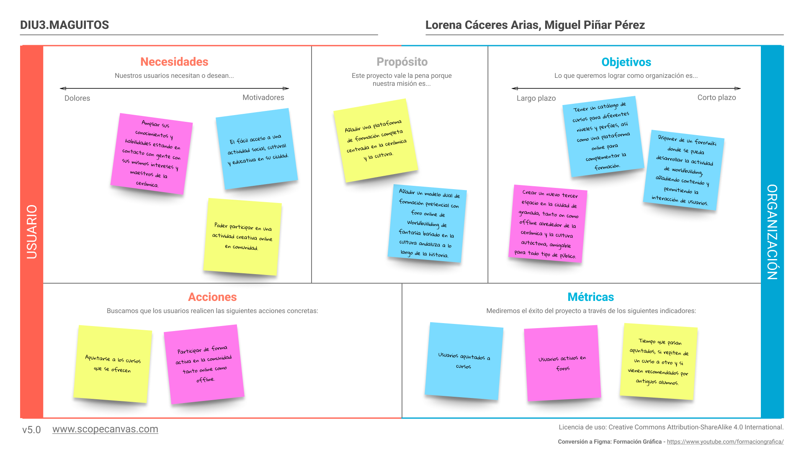
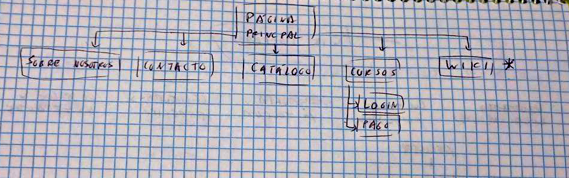
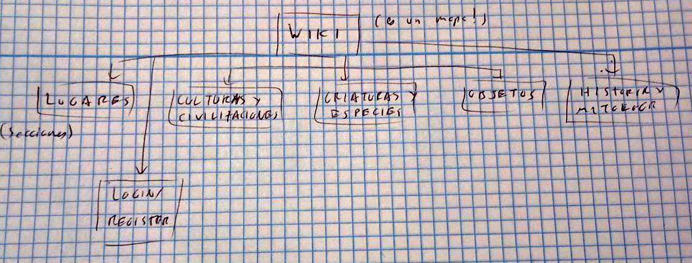
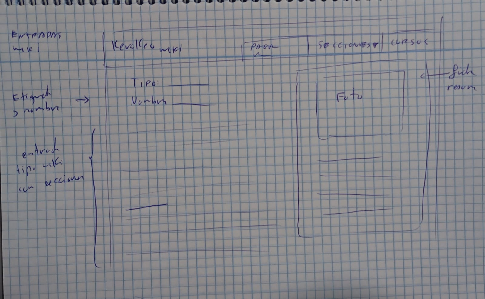
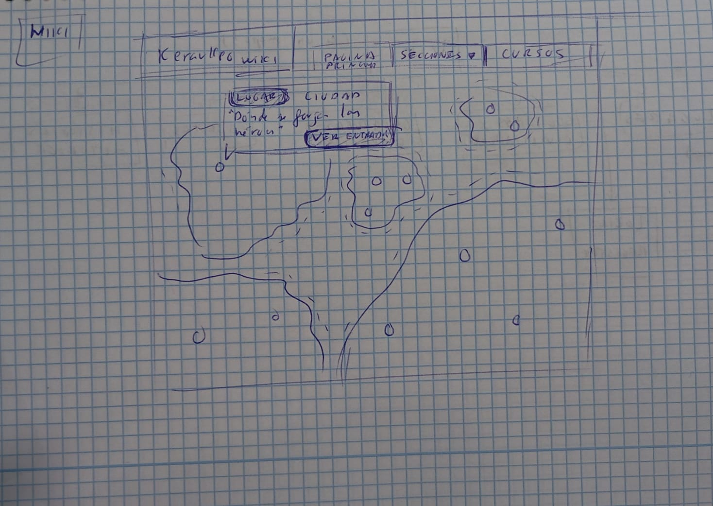
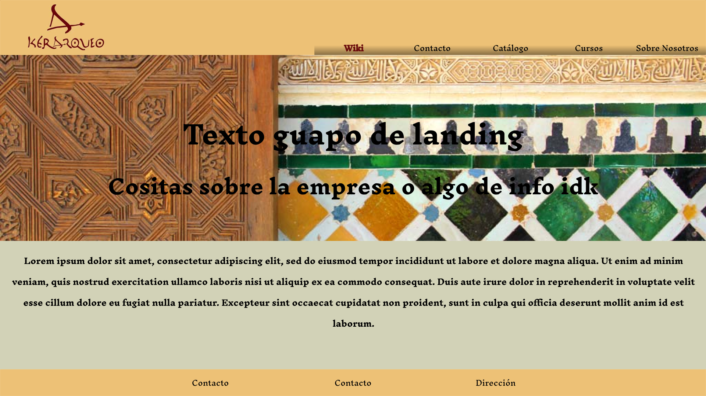
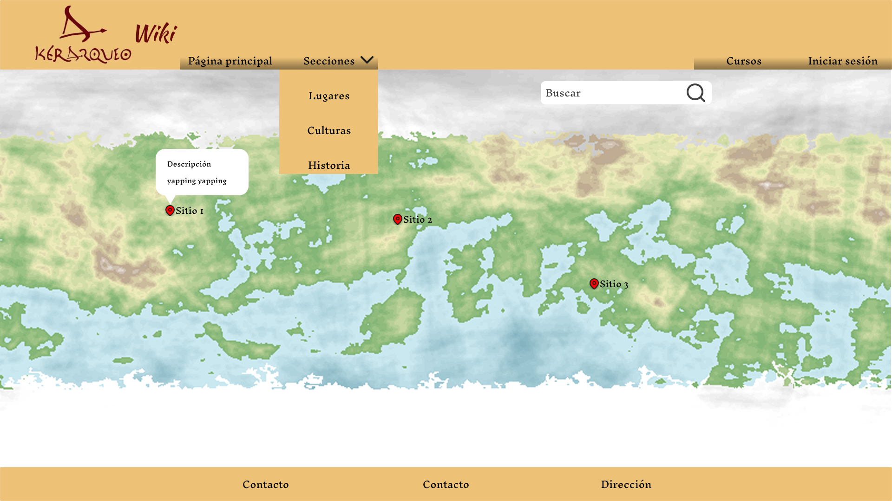
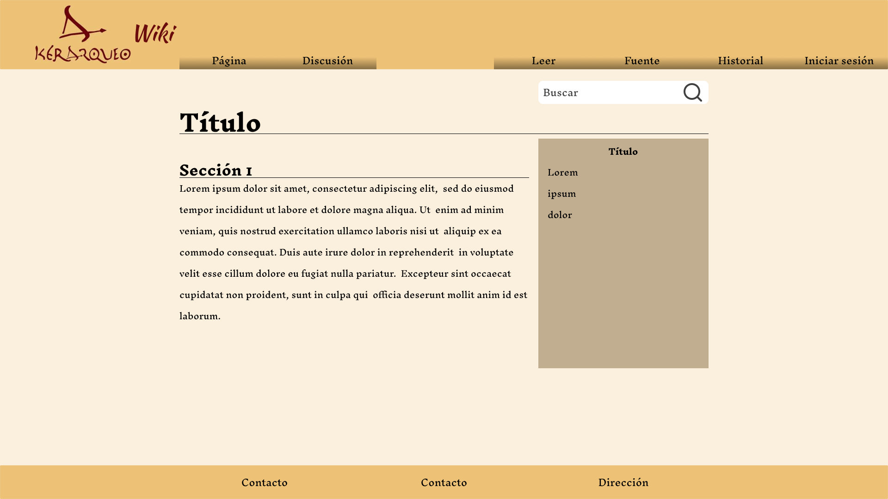

## DIU - Practica2, entregables

### Ideación 
* Malla receptora de información
* <strike>Mapa de empatía</strike>
* <strike>Point of View </strike>

### PROPUESTA DE VALOR
* ScopeCanvas

Esto fue lo primero que desarrollamos. Partimos de una idea fruto de plantear varias cosas y ver que nos motivaba más. Teniendo una idea general, fuimos siguiente los pasos de Canvas para darle forma, usando el documento como herramiente generativa para aterrizar los conceptos.

### TASK ANALYSIS

* User Task Matrix 
* User/Task flow

### ARQUITECTURA DE INFORMACIÓN

* Sitemap
 
 
* Labelling
  | ------------- | -------
  Sobre nosotros  | Info general de la empresa y sus creadoras
  Contacto | Formulario de contacto y link a redes
  Catálogo | Tienda en forma de lista 
  Cursos | Listado con información de los cursos
  Login | pagina para inicar sesión
  Pago | Página para pagar los cursos
  Wiki | Mapa con localizaciones y acceso a las secciones con entradas
  Lugares | Lista de entradas en la wiki con la etiqueta lugar
  Culturas y Civilizaciones | Lista de entradas en la wiki con la etiqueta cultura o civilización
  Criaturas y Especies | Lista de entradas en la wiki con la etiqueta criatura o especie
  Objetos | Lista de entradas en la wiki con la etiqueta objeto
  Historia y Mitología | Lista de entradas en la wiki con la etiqueta historia o mitología

Hemos hecho una estrucutra muy genérica para el inicio y la parte de inicio de sesión. Hemos intentado darle más profundidad y cariño a la estructura de la wiki, que creemos que se puede llegar a complicar si no se planea desde el principio.

### Prototipo Lo-FI Wireframe 
 

### Conclusiones  
Creemos que tenemos una prpuesta de valor sólida y original. Hemos intentado usar lo que se nos propone como el Scope Canvas y el Capture Grid como herramientas de generación y no solo pdfs que rellenar, y creo que ese workflow es extrapolable a otros proyectos. Siempre es un gusto poder llevarte cosas así de una asignatura para el futuro.

Nos cuesta usar las herramientas, pero no por que sean difíciles, es que nos cuesta ponernos a hacer las prácticas.

>>>> Este fichero se debe editar para que cada evidencia quede enlazada con el recurso subido a la carpeta de la practica. Se pide más detalle técnico en las descripciones de lo que sería el README principal del repositorio y que corresponde a la descripcion del Case Study.
>>>> Termine con la seccion de Conclusiones para aportar una valoración final del equipo sobre la propia realización de la práctica
