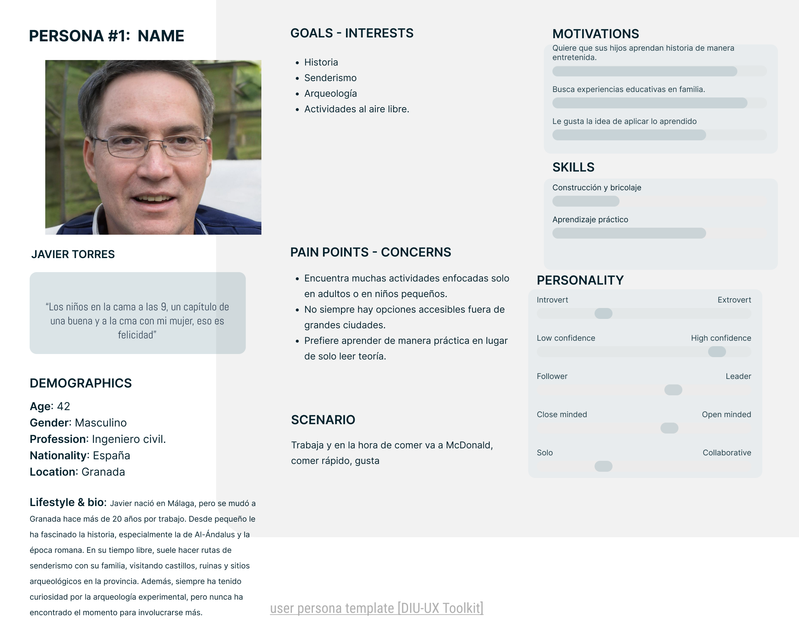
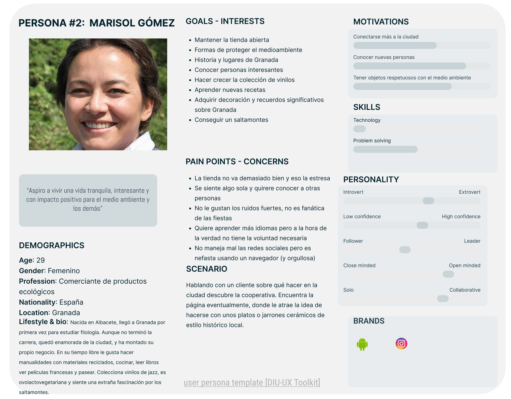
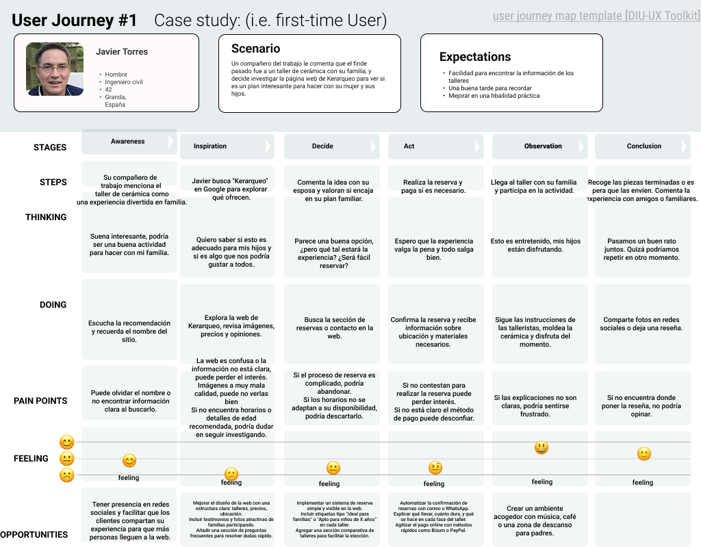
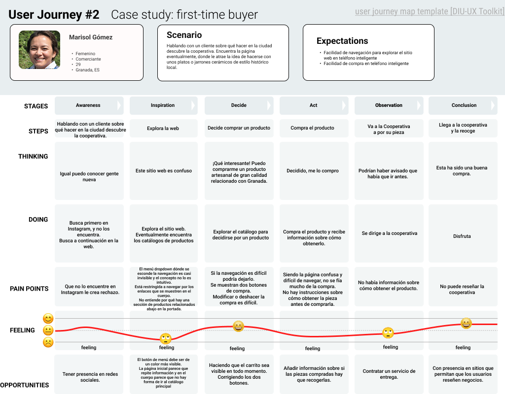

# DIU25
Prácticas Diseño Interfaces de Usuario (Tema: Reciclaje y artesanía (handcraft) ) 

[Guiones de prácticas](GuionesPracticas/)

Grupo: DIU3.Maguitos  Curso: 2024/25 

Actualizado: 04/18/2025

Proyecto: 

>>> Kerarkeo, arqueología, cerámica y patrimonio

Descripción: 

>>> Describa la idea de su producto en la práctica 2 

Logotipo: 

>>> Si diseña un logotipo para su producto en la práctica 3 pongalo aqui, a un tamaño adecuado. Si diseña un slogan añadalo aquí

Miembros:
 * :bust_in_silhouette:  [[Lorena Cáceres Arias]](https://github.com/lorenax55)    :octocat:     
 * :bust_in_silhouette:  [[Miguel Piñar Pérez]](https://github.com/LeugimPipe)     :octocat:

----- 

>>> Este documento es el esqueleto del Case Study que explica el proceso de desarrollo de las 5 prácticas de DIU. Aparte de subir cada entrega a PRADO, se debe actualizar y dar formato de informe final a este documento online. Elimine este tipo de texto / comentarios desde la práctica 1 conforme proceda a cada paso

# Proceso de Diseño 

 

## Paso 1. UX User & Desk Research & Analisis 

### 1.a User Reseach Plan
 
-----

El contexto en el que los sitios web a evaluar se encuentran es uno de actividades
culturales, centrado en el reciclaje y la artesanía. Los sitios están asociados a empresas o
grupos que se dedican a este campo. Estos grupos producen objetos (prendas de ropa,
piezas de cerámica u otras piezas de artesanía), a menudo a partir de materiales reciclados
o materias primas, soliendo usar métodos tradicionales o artesanales. Algunos ofrecen a
participantes del público general colaborar en el proceso de creación mediante talleres, y
exponen las obras que también se ponen en venta en muchos casos.
Por tanto, para el análisis de usabilidad y experiencia de usuario en estos sitios, se podrían
utilizar métodos como entrevistas a potenciales usuarios, personas y mapas de
experiencias de usuario para estas tareas, o análisis de analíticas.

### 1.b Competitive Analysis
 
-----
# Análisis de Competencia en el Sector de la Cerámica, Restauración Arqueológica y Artesanía  

Se ha realizado un análisis de varias páginas web que operan en el sector de la cerámica, la restauración arqueológica y la artesanía, con el fin de evaluar sus fortalezas y debilidades en comparación con **KERARQUEO**. A continuación, se presenta un breve análisis de tres competidores relevantes y la justificación de la selección de **KERARQUEO** para esta práctica.  

---

## 1. [www.kerarqueo.com](http://www.kerarqueo.com)  

### **Fortalezas**  
- Contenido completo y detallado sobre los servicios ofrecidos.  
- Fotografías que reflejan el trabajo artesanal.  
- Formulario de contacto y ubicación.  

### **Debilidades**  
- Navegabilidad deficiente, con transiciones poco intuitivas entre secciones.  
- Diseño desactualizado, con falta de jerarquía visual clara.  
- Fotos de baja calidad.  
- No incluye un sistema de tienda online optimizado para facilitar la compra de productos.  

---

## 2. [https://pepamoreno.com/tienda-online](https://pepamoreno.com/tienda-online)  

### **Fortalezas**  
- Diseño visual atractivo y moderno, con imágenes de productos bien organizadas.  
- Experiencia de usuario optimizada para la compra en línea, con filtros y categorías.  
- Blog educativo con contenido sobre cerámica y procesos de restauración.  

### **Debilidades**  
- Enfoque más comercial, menos centrado en la restauración arqueológica.  
- Información más generalista, sin destacar procesos específicos de conservación.  

---

## 3. [https://tonypotter.es](https://tonypotter.es)  

### **Fortalezas**  
- Multitud de actividades para todas las edades.  
- Documentación técnica disponible para profesionales del sector.  
- Opción en inglés y en español.  

### **Debilidades**  
- Nada centrado en el patrimonio y la conservación.  
- No tiene una tienda online, lo que limita su público a clientes profesionales.  

### 1.c Personas
 
-----

### 1.d User Journey Map
 
----

### 1.e Usability Review
 
----

>>>  El objetivo es revisar la usabilidad del competidor seleccionado. Usamos un checklist de verificación. Tras usarlo, subelo a la carpeta P1/ Ofrece aquí un parrafo para:
>>> - Enlace al documento:  (xls/pdf) 
>>> - URL y Valoración numérica obtenida: 
>>> - Comentario sobre la revisión:  (puntos fuertes y débiles detectados)

 

## Paso 2. UX Design  

>>> Cualquier título puede ser adaptado. Recuerda borrar estos comentarios del template en tu documento

### 2.a Reframing / IDEACION: Feedback Capture Grid / EMpathy map 
 
----

>>> Comenta con un diagrama los aspectos más destacados a modo de conclusion de la práctica anterior. De qué carece la competencia?? Tu diagrama puede ser una figura subida a la carpeta P2/

 Interesante | Críticas     
| ------------- | -------
  Preguntas | Nuevas ideas
  
    
>>> Explica el Problema y plantea una hipótesis. Es decir, explica aquí qué 
>>> se plantea como "propuesta de valor" para un nuevo diseño de aplicación propio

### 2.b ScopeCanvas

----

>>> Propuesta de valor, pero ahora en vez de un texto es un ScopeCanvas que has subido a P2/ y enlazado desde aqui. Tambien vale una imagen miniatura del recurso.
>>> No olvides que tu propuesta ya tiene un nombre corto y puedes actualizar la cabecera de este archivo

### 2.b User Flow (task) analysis 
 
-----

>>> Definir "User Map" y "Task Flow" ... enlazar desde P2/ y describir brevemente

### 2.c IA: Sitemap + Labelling 
 
----

>>> Identificar términos para diálogo con usuario (evita el spanglish) y la arquitectura de la información. Es muy apropiado un diagrama tipo sitemap y una tabla que se ampliaría para llevar asociado la columna iconos (tanto para la web como para una app). 

Término | Significado     
| ------------- | -------
  Login  | acceder a plataforma

### 2.d Wireframes
 
-----

>>> Plantear el diseño del layout para Web/movil (organización y simulación). Describa la herramienta usada 

 

## Paso 3. Mi UX-Case Study (diseño)

>>> Cualquier título puede ser adaptado. Recuerda borrar estos comentarios del template en tu documento

### 3.a Moodboard

-----

>>> Diseño visual con una guía de estilos visual (moodboard) 
>>> Incluir Logotipo. Todos los recursos estarán subidos a la carpeta P3/
>>> Explique aqui la/s herramienta/s utilizada/s y el por qué de la resolución empleada. Reflexione ¿Se puede usar esta imagen como cabecera de Instagram, por ejemplo, o se necesitan otras?

### 3.b Landing Page
 
----

>>> Plantear el Landing Page del producto. Aplica estilos definidos en el moodboard

### 3.c Guidelines
 
----

>>> Estudio de Guidelines y explicación de los Patrones IU a usar 
>>> Es decir, tras documentarse, muestre las deciones tomadas sobre Patrones IU a usar para la fase siguiente de prototipado. 

### 3.d Mockup
 
----

>>> Consiste en tener un Layout en acción. Un Mockup es un prototipo HTML que permite simular tareas con estilo de IU seleccionado. Muy útil para compartir con stakeholders

### 3.e ¿My UX-Case Study?
 
-----

>>> Publicar my Case Study en Github... Es el momento de dejar este documento para que sea evaluado y calificado como parte de la práctica
>>> Documente bien la cabecera y asegurese que ha resumido los pasos realizados para el diseño de su producto

 

## Paso 4. Pruebas de Evaluación 

### 4.a Reclutamiento de usuarios 

-----

>>> Breve descripción del caso asignado (llamado Caso-B) con enlace al repositorio Github
>>> Tabla y asignación de personas ficticias (o reales) a las pruebas. Exprese las ideas de posibles situaciones conflictivas de esa persona en las propuestas evaluadas. Mínimo 4 usuarios: asigne 2 al Caso A y 2 al caso B.

| Usuarios | Sexo/Edad     | Ocupación   |  Exp.TIC    | Personalidad | Plataforma | Caso
| ------------- | -------- | ----------- | ----------- | -----------  | ---------- | ----
| User1's name  | H / 18   | Estudiante  | Media       | Introvertido | Web.       | A 
| User2's name  | H / 18   | Estudiante  | Media       | Timido       | Web        | A 
| User3's name  | M / 35   | Abogado     | Baja        | Emocional    | móvil      | B 
| User4's name  | H / 18   | Estudiante  | Media       | Racional     | Web        | B 

### 4.b Diseño de las pruebas 
 
-----

>>> Planifique qué pruebas se van a desarrollar. ¿En qué consisten? ¿Se hará uso del checklist de la P1?

### 4.c Cuestionario SUS
 
----

>>> Como uno de los test para la prueba A/B testing, usaremos el **Cuestionario SUS** que permite valorar la satisfacción de cada usuario con el diseño utilizado (casos A o B). Para calcular la valoración numérica y la etiqueta linguistica resultante usamos la [hoja de cálculo](https://github.com/mgea/DIU19/blob/master/Cuestionario%20SUS%20DIU.xlsx). Previamente conozca en qué consiste la escala SUS y cómo se interpretan sus resultados
http://usabilitygeek.com/how-to-use-the-system-usability-scale-sus-to-evaluate-the-usability-of-your-website/)
Para más información, consultar aquí sobre la [metodología SUS](https://cui.unige.ch/isi/icle-wiki/_media/ipm:test-suschapt.pdf)
>>> Adjuntar en la carpeta P4/ el excel resultante y describa aquí la valoración personal de los resultados 

### 4.d A/B Testing
 
-----

>>> Los resultados de un A/B testing con 3 pruebas y 2 casos o alternativas daría como resultado una tabla de 3 filas y 2 columnas, además de un resultado agregado global. Especifique con claridad el resultado: qué caso es más usable, A o B?

### 4.e Aplicación del método Eye Tracking 

----

>>> Indica cómo se diseña el experimento y se reclutan los usuarios. Explica la herramienta / uso de gazerecorder.com u otra similar. Aplíquese únicamente al caso B.

  
>>> Cambiar esta img por una de vuestro experimento. El recurso deberá estar subido a la carpeta P4/  

>>> gazerecorder en versión de pruebas puede estar limitada a 3 usuarios para generar mapa de calor (crédito > 0 para que funcione) 

### 4.f Usability Report de B
 
-----

>>> Añadir report de usabilidad para práctica B (la de los compañeros) aportando resultados y valoración de cada debilidad de usabilidad. 
>>> Enlazar aqui con el archivo subido a P4/ que indica qué equipo evalua a qué otro equipo.

>>> Complementad el Case Study en su Paso 4 con una Valoración personal del equipo sobre esta tarea

 

## Paso 5. Exportación y Documentación 

### 5.a Exportación a HTML/React
 
----

>>> Breve descripción de esta tarea. Las evidencias de este paso quedan subidas a P5/

### 5.b Documentación con Storybook

----

>>> Breve descripción de esta tarea. Las evidencias de este paso quedan subidas a P5/

 

## Conclusiones finales & Valoración de las prácticas

>>> Opinión FINAL del proceso de desarrollo de diseño siguiendo metodología UX y valoración (positiva /negativa) de los resultados obtenidos. ¿Qué se puede mejorar? Recuerda que este tipo de texto se debe eliminar del template que se os proporciona 

